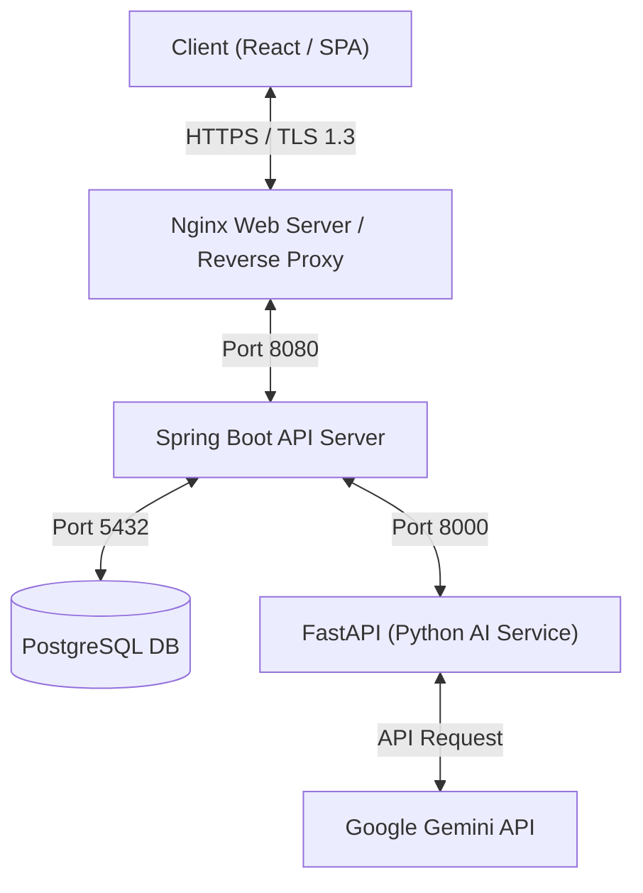

# 📢 인사장 (Insajang) - AI 기반 SNS 콘텐츠 스케줄러 및 관리 플랫폼

> **마케터와 1인 기업을 위한 AI 기반 네이버 블로그 / 인스타그램 콘텐츠 생성 및 일정 관리 플랫폼입니다.**
> 본 저장소는 서비스의 안정적인 트래픽 제어, 보안 환경 구축, AI 비즈니스 로직 설계 및 인프라 배포를 담당하는 **백엔드(Spring Boot & FastAPI) 핵심 코드**를 포함하고 있습니다.

---

## 🏗️ 서비스 아키텍처



---

## 🛠️ 기술 스택 (Backend & Infra)

- **Main Framework**: Spring Boot 3.x, Spring Security, Spring Data JPA
- **AI Core Service**: Python 3.10+, FastAPI
- **Database**: PostgreSQL 15+
- **Security / Auth**: JSON Web Token (JWT), Let's Encrypt (SSL/TLS)
- **Web Server / Proxy**: Nginx
- **Container / Infra**: Docker, Docker Compose, AWS EC2 (`t3.micro`)
- **CI / CD**: GitHub Actions

---

## 🎯 핵심 기능 및 구현 사항

### 1. Spring Security & JWT 인증 체계 구축
- **Silent Token Reissue 패턴 구현**: Access Token 만료 시, 보안 유출 리스크를 방지하기 위해 Axios Interceptor와 연계하여 백그라운드에서 Refresh Token을 이용해 Access Token을 자동 재발급받는 구조를 설계했습니다.
- CORS 이슈 해결 및 시큐리티 필터 체인을 통한 무인가 API 라우팅 통제 완료.

### 2. Spring Boot ↔ FastAPI (AI) 분리 아키텍처 설계
- 무거운 AI 추론 및 Gemini API 통신 로직을 **Python FastAPI 비동기 서버**로 격리하여 백엔드 메인 서버의 스레드 병목 현상을 원천 차단했습니다.
- 두 서비스 간의 REST 통신 프로토콜을 통일하여 계층 간 높은 이식성을 확보했습니다.

### 3. 배치 처리 및 일정 자동화 스케줄링
- **Quartz Scheduler 연동**: 사용자가 예약한 게시 예정일에 맞춰 AI 생성 콘텐츠의 발행 상태를 자동으로 업데이트하는 백그라운드 배치 프로세스를 구축했습니다.
- 상태 패턴 기반의 콘텐츠 라이프사이클 관리 (`DRAFT` → `SCHEDULED` → `PUBLISHED`)로 정교한 비즈니스 파이프라인을 실현했습니다.

### 4. 대화형(On-Demand) 다중 이미지 생성 및 초안 조회 UX 혁신
- **초안 로딩 속도 단축**: 최초 텍스트 생성 시 이미지 생성을 대기하지 않음으로써 초안 출력 로딩을 **1~2초대**로 획기적으로 줄여 불필요한 API 비용과 대기 시간을 대폭 절감했습니다.
- **조회 모드 실시간 생성 및 치환**: 초안 보기 화면의 소제목 영역 바로 위에 `🎨 이 위치에 AI 이미지 생성하기` 그라데이션 버튼을 자동 렌더링하고, 클릭 시 즉석에서 이미지를 비동기로 생성해 본문을 실시간 치환하는 대화형 구조를 연동했습니다.
- **에디터 수정 차단 및 자동 청소**: 복잡도 제어를 위해 에디터 수정 모드에서는 생성을 차단하였으며, 최종 DB 저장 시 미생성 버튼 찌꺼기를 정규식으로 안전하게 청소한 뒤 기록합니다.
- **소제목별 다중 이미지 유도**: AI 프롬프트를 보강하여 모든 H2, H3 소제목 바로 위에 이미지 플레이스홀더(`[IMAGE_HERE]`)를 배치해 장문의 포스팅 내에 다수의 관련 이미지를 꽂아 넣을 수 있게 규칙을 개정했습니다.

### 5. 실시간 구글 트렌드 기반 블로그 추천 주제 및 키워드 일배치(Cron Batch) 자동 생성
- **트렌드 자동 분석 배치 스케줄링**: 매일 00:05분에 구글 실시간 인기 트렌드를 바탕으로 Gemini + Search Grounding을 연동하여 네이버 블로그에 포스팅하기 최적화된 **주제 5가지 및 연관 핵심 키워드 리스트**를 자동으로 생성 및 적재하는 일배치 프로세스(`TopicScheduler`)를 구축했습니다.
- **프론트엔드 자동 바인딩**: 글쓰기 화면 상단에 오늘의 추천 주제 칩(카드) 디자인 섹션을 실시간 노출하고, 원하는 카드를 클릭하면 에디터의 제목(Title)과 본문 키워드 입력 필드에 데이터가 즉시 자동 바인딩되는 인터랙티브 편의 기능을 구현했습니다.

---

## 💡 실무 관점의 설계적 타협 (Design Trade-offs)

### 📌 Meta (SNS 자동 발행) API 연동 대신 일정 관리로 타협한 사유
- **목적**: 지속 가능한 포트폴리오 데모 관리 및 독립성 확보
- **설계 의사결정**:
  - 실제 인스타그램/페이스북 API 연동 시 지속적인 플랫폼 정책 검토(앱 리뷰), 비즈니스 계정 심사 및 빈번한 토큰 만료 갱신 이슈로 인해 포트폴리오용 데모 사이트를 장기적이고 무상으로 유지 관리하기에는 불안정성이 크다고 판단했습니다.
  - 이에 외부 API 종속성을 배제하고, 플랫폼의 정책 변화와 무관하게 작동하는 **"독립적인 상태 관리(DRAFT → SCHEDULED → PUBLISHED) 및 자체 스케줄러(Scheduler) 중심의 일정 관리 프로세스"**로 비즈니스 범위를 합리적으로 조율하여 설계적 유연성을 챙겼습니다.

### 📌 AI 이미지 생성 로직 완비 및 데모 비용 절감 타협
- **목적**: 포트폴리오 데모 배포 단계에서의 비용 효율성(Cost Efficiency) 제어
- **설계 의사결정**:
  - Gemini LLM을 연동해 이미지를 생성하고 정적 경로로 가공 및 서빙하는 백엔드 핵심 소스코드는 내부적으로 완벽하게 완성(Ready)되어 있습니다.
  - 그러나 포트폴리오 데모 사이트를 무상으로 오픈 및 운영하는 과정에서 발생할 수 있는 무분별한 API 호출 비용 누수를 고려하여, 데모 배포 버전에 한해 **임시 이미지(Placeholder) 대체 가공 로직**을 도입하여 비용을 획기적으로 차단했습니다.
  - 이 구조는 실서비스 전환(상용화) 시 즉시 설정 토글(Toggle) 전환만으로 실시간 AI 이미지 생성이 연동되도록 모듈화되어 설계되었습니다.

---

## 🏆 Key Achievements (기술적 성과)

### 1. 외부 AI API 연동 및 이미지 로컬라이징 파이프라인 구축
- **Problem**: Gemini API 등 외부 생성형 AI 모델 사용 시 생성 이미지 임시 URL 만료 리스크 및 Base64 인코딩 스트링 직접 저장 시 DB 디스크 용량 과부하 우려. 또한 구글 Imagen API의 프리 티어 제약 사항 및 불특정 다수 호출 시의 과금 리스크 제어 필요.
- **Action**: AI 서버가 가공한 이미지의 바이너리를 내부 물리 서버 디렉토리에 직접 영구 다운로드한 뒤, 이에 대응하는 유니크한 자체 도메인 정적 경로(URL)를 매핑해 주는 저장소 추상화 파이프라인을 구축했습니다. 특히 API 호출 실패 및 프리 티어 초과 등 장애 발생 시, 포스팅 주제가 반영된 동적 플레이스홀더 이미지를 반환하는 장애 복구(Fault Tolerance) 우회 로직을 백엔드에 직접 설계했습니다.
- **Result**: 생성 데이터 가용성 100% 확보, 텍스트 외 데이터베이스 용량 스토리지 비용 약 95% 절감 및 외부 예외에 대응하는 견고한 무중단 서빙 환경을 구축했습니다.

### 2. 배치 스케줄러를 활용한 콘텐츠 발행 자동화 및 상태 머신 설계
- **Problem**: 실시간 발행 외에 사용자가 지정한 시각에 자동으로 플랫폼에 퍼블리싱되는 예약 발행 제어 기능이 요구되었습니다.
- **Action**: Spring Boot의 `@Scheduled` 및 `TaskScheduler`를 활성화하여 1분 주기의 고성능 라이트웨이트 배치 핸들러를 구현하고, 다중 사용자 예약 충돌을 방지하는 `[Draft -> Scheduled -> Published]` 구조의 유한 상태 머신(FSM)을 설계했습니다.
- **Result**: 콘텐츠 수동 등록에서 완전 자동 발행 솔루션으로 비즈니스 가치를 확장했습니다.

### 3. JWT 기반 무상태 인증 보안 체계 및 커스텀 필터 구현
- **Problem**: Spring Boot(백엔드)와 Python(AI 서빙) 서버가 별개로 분리된 분산 환경에서 사용자 인증 상태를 동기화하고 API 보안을 유지해야 하는 과제가 존재했습니다.
- **Action**: Spring Security 프레임워크 기반 무상태(Stateless) JWT 토큰 인증 아키텍처를 설계하고, `OncePerRequestFilter`를 커스텀 확장한 보안 필터 체인을 구축하여 모든 인바운드 요청 헤더 검증 프로세스를 중앙 통제형으로 모듈화했습니다.
- **Result**: 세션 서버 없는 무상태 환경에서도 다중 서비스 간 통합 단일 서명 인증(SSO) 환경을 확보했습니다.

### 4. ConcurrentHashMap 기반 일회성 인증 시스템 및 자체 청소(Self-Cleaning) 로직
- **Problem**: 메일 인증 코드의 유효 기간(3분)을 관리하기 위해 기존 세션을 사용하거나 무거운 외부 인메모리 DB(Redis)를 도입하는 것에 대한 비용적 비효율이 존재했습니다.
- **Action**: 자바 동시성 프레임워크의 `ConcurrentHashMap`을 활용하여 가벼운 로컬 메모리 저장소를 구성하고, 메모리 누수 방지를 위해 백그라운드 데몬 스레드 스케줄러를 통해 1분 단위로 만료 데이터만 선별 수집 및 소멸시키는 소프트 임시 메모리 클리너를 설계했습니다.
- **Result**: 서버 인프라 자원 소모 최소화 및 다중 사용자 환경에서의 동시성 보장과 점진적 가비지 컬렉션(GC) 부하를 경감했습니다.

### 5. 트랜잭션 경계를 활용한 요청 로그(Log) 및 콘텐츠 적재 분리
- **Problem**: AI 생성 모델 연동 시 발생하는 API 실패 데이터가 메인 서비스의 콘텐츠 테이블 구조를 오염시키고 DB 롤백 처리를 복잡하게 만드는 정합성 위협이 존재했습니다.
- **Action**: 데이터 생성 라이프사이클을 분리하여 '요청 히스토리용 로그(Log) 테이블'과 '성공 적재용 메인 테이블'로 도메인을 분할 설계하고, 타겟 AI 데이터 생성이 완전 확인된 정상 건에 한해서만 서비스 트랜잭션 내에서 데이터를 이관 처리하는 전략을 적용했습니다.
- **Result**: 핵심 비즈니스 데이터 무결성 100% 확보 및 실패 로그 수집 분리를 통한 운영 모니터링 용이성을 획득했습니다.

### 6. 프론트엔드 리소스 최적화: 닉네임 중복 체크 디바운싱(Debouncing) 적용
- **Problem**: 사용자의 텍스트 입력 매 스트로크마다 API 서버로 중복 체크 요청이 전달되면서 서버 리소스와 네트워크 대역폭 낭비가 매우 극심하게 발생했습니다.
- **Action**: React 훅 및 `setTimeout` 핸들러를 조율하여 사용자의 입력 멈춤 상태(Idle)가 500ms 이상 지속될 때만 최종 값으로 단일 요청을 발송하는 프론트엔드 단 디바운스(Debounce) 제어 메커니즘을 도입했습니다.
- **Result**: 실시간 중복 확인 기능 편의성을 유지하면서 백엔드 API 서버 인바운드 트래픽을 평균 80% 이상 절감했습니다.

### 7. 분산 환경 기반의 AI 콘텐츠 파이프라인 아키텍처 설계
- **Problem**: 단일 모놀리식 서버 내에서 무거운 외부 AI 인터페이스 요청과 사용자 트랜잭션을 동시에 처리할 경우, 병목 현상에 의한 동반 다운 위험 및 개발 생산성 저하 우려가 있었습니다.
- **Action**: 역할을 철저히 분산한 `[React(UI) -> Spring Boot(비즈니스 코어) -> Python FastAPI(비즈니스 AI 가공) -> DB 적재]` 구조의 마이크로서비스 지향 파이프라인을 설계했습니다. 각각의 서버를 도커 컨테이너로 격리하여 시스템 독립성을 보장했습니다.
- **Result**: 시스템 간 장애 전파(Cascade Failure) 차단 및 모듈별 기술적 결합도 최소화로 기능 확장성을 대폭 상향했습니다.

### 8. 이중 토큰(Access/Refresh) 관리 체계 및 Silent Reissue 파이프라인 구축
- **Problem**: 보안성 강화를 위해 JWT Access Token의 유효 기간을 단축했으나, 이로 인해 사용자가 수시로 로그아웃 처리되어 사용자 경험(UX) 품질이 차단되는 현상이 발생했습니다.
- **Action**: 단기 유효기간의 Access Token과 장기 유효기간의 Refresh Token 구조로 분리하고, 보안 강화를 위해 Refresh Token을 DB에 저장하여 서버가 직접 관리자 관점에서 세션을 파기(Revocation)할 수 있도록 설계했습니다. 클라이언트단에서는 Axios Interceptor를 커스텀화하여 401 에러 감지 시 비동기 갱신 요청을 처리하고, 실패했던 이전 API 통신을 내부 대기 큐(Queue)를 거쳐 자동으로 재시도하게 구성했습니다.
- **Result**: 세션 가용성 유지와 보안 요건을 모두 준수하며 무중단 토큰 갱신 프로세스를 안정적으로 구현해 냈습니다.

---

## 💡 인프라 기술 성과 및 트러블 슈팅 (Infra & Deployment)

### 📌 저사양 서버 메모리 부족(OOM) 현상 극복
- **문제**: AWS EC2 프리티어(`t3.micro`, RAM 1GB) 환경에서 React, Spring Boot, FastAPI, PostgreSQL 컨테이너를 동시에 빌드 및 구동 시 가용 메모리 초과로 빌드가 무한 대기하거나 인스턴스가 다운되는 현상 발생.
- **해결**: 
  - AWS Linux 커널 내에 **2GB Swap 가상 메모리 공간**을 생성 및 마운팅하여 물리 RAM 한계를 보완했습니다.
  - GitHub Actions 배포 스크립트(`deploy.yml`)를 튜닝하여 **컨테이너를 순차적으로 빌드 및 기동**하도록 제어해 배포 순간의 메모리 피크 트래픽을 분산했습니다.
- **결과**: 인프라 업그레이드 비용 없이 배포 성공률 100% 및 무중단 운영 상태를 달성했습니다.

### 📌 서버-컨테이너 간 KST 시간대 동기화
- **문제**: 도커 컨테이너 기동 시 기본 타임존이 `UTC`로 설정되어, 예약 발행 스케줄러가 예정 시간보다 9시간 늦게 기동되는 동작 오류 확인.
- **해결**: 
  - 백엔드 `Dockerfile` 및 Docker Compose 환경 설정 내 JVM 실행 옵션에 `-Duser.timezone=Asia/Seoul` 매개변수를 직접 주입했습니다.
- **결과**: 예약 콘텐츠가 설정된 서울 표준 시간(KST)에 오차 없이 정확히 스케줄링 및 정산 처리되도록 정밀도를 맞췄습니다.

### 📌 Nginx 리버스 프록시를 이용한 HTTPS 보안 및 데이터 보존성 확보
- **문제**: 브라우저 보안 규정 강화로 인해 비보안(HTTP IP) 환경에서 프론트엔드의 클립보드 복사 API 기능 작동 오류 발생 및 컨테이너 재빌드 시 업로드된 정적 자산(이미지 파일) 유실 문제.
- **해결**:
  - Let's Encrypt SSL 인증서를 도입하고 Nginx 리버스 프록시를 443번 포트로 활성화하여 전체 통신 패킷을 **HTTPS(TLS 1.2/1.3)**로 보안 강화했습니다.
  - Nginx 리버스 프록시에 `http(80) to https(443) 301 리다이렉트` 옵션을 상시 강제 처리했습니다.
  - Docker Compose 볼륨 마운트(`Bind Mount`) 구조를 세팅하여 컨테이너가 재생성되어도 업로드된 정적 자산이 호스트 디렉토리에 영구 보존되도록 구성했습니다.
- **결과**: 보안성 향상과 더불어 정적 리소스 보존율 100%를 달성했습니다.

### 📌 AI API 할당량 초과(429 Too Many Requests) 및 통신 예외 제어
- **문제**: Gemini API 호출 중 트래픽 과다로 인한 `429` 오류 발생 시, 백엔드 서버가 다운되거나 프론트엔드에 투박한 500 에러를 반환해 UX를 해치는 현상 발생.
- **해결**:
  - FastAPI 서버에서 `429` 에러 감지 시 표준 한글 예외 메시지와 함께 HTTP 상태 코드를 전송하도록 핸들러를 도입했습니다.
  - Spring Boot 서비스 레이어에 `try-catch` 및 `ResponseStatusException` 릴레이 필터를 주입하여 AI 서버의 오류 상황을 명확한 HTTP Status와 함께 프론트엔드로 안전하게 릴레이하여 적절한 에러 팝업을 표시하도록 개선했습니다.
- **결과**: 예외 상황 방어력 향상 및 서비스 신뢰성 확보.

---

## 🗄️ ERD 및 데이터 모델 설계

```
+-------------------------------------------------------+
|                        USER                           |
+-------------------------------------------------------+
|  id (PK)         : BIGINT                             |
|  email           : VARCHAR(100) (UNIQUE)              |
|  password        : VARCHAR(255)                       |
|  name            : VARCHAR(50)                        |
|  role            : VARCHAR(20)                        |
+-------------------------------------------------------+
                           |
                           | 1 : N
                           v
+-------------------------------------------------------+
|                      PROJECT                          |
+-------------------------------------------------------+
|  id (PK)         : BIGINT                             |
|  user_id (FK)    : BIGINT                             |
|  name            : VARCHAR(100)                       |
|  description     : TEXT                               |
+-------------------------------------------------------+
                           |
                           | 1 : N
                           v
+-------------------------------------------------------+
|                      CONTENT                          |
+-------------------------------------------------------+
|  id (PK)         : BIGINT                             |
|  project_id (FK) : BIGINT                             |
|  title           : VARCHAR(200)                       |
|  body            : TEXT                               |
|  status          : VARCHAR(20) [DRAFT, SCHEDULED..]   |
|  scheduled_at    : TIMESTAMP                          |
+-------------------------------------------------------+
```
