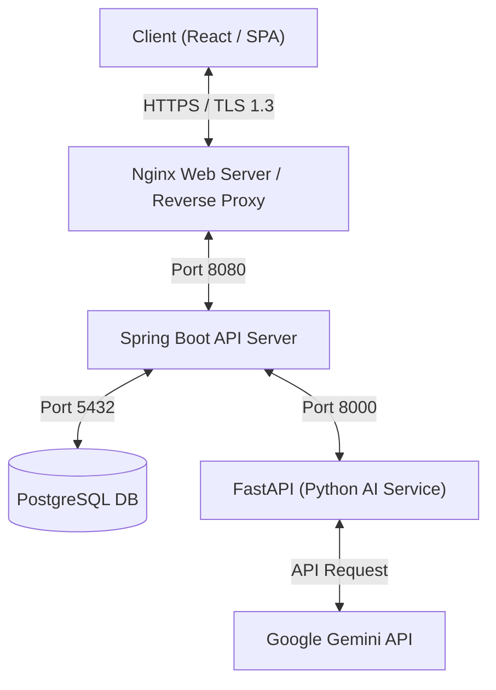

# 📢 인사장 (Insajang) - AI 기반 SNS 콘텐츠 스케줄러 및 관리 플랫폼

> **마케터와 1인 기업을 위한 AI 기반 네이버 블로그 / 인스타그램 콘텐츠 생성 및 일정 관리 플랫폼입니다.**
> 본 저장소는 서비스의 안정적인 트래픽 제어, 보안 환경 구축, AI 비즈니스 로직 설계 및 인프라 배포를 담당하는 **백엔드(Spring Boot & FastAPI) 핵심 코드**를 포함하고 있습니다.

---

## 🏗️ 서비스 아키텍처



---

## 🛠️ 기술 스택 (Backend & Infra)

- **Main Framework**: Spring Boot 3.x, Spring Security, Spring Data JPA
- **AI Core Service**: Python 3.10+, FastAPI
- **Database**: PostgreSQL 15+
- **Security / Auth**: JSON Web Token (JWT), Let's Encrypt (SSL/TLS)
- **Web Server / Proxy**: Nginx
- **Container / Infra**: Docker, Docker Compose, AWS EC2 (`t3.micro`)
- **CI / CD**: GitHub Actions

---

## 🎯 핵심 기능 및 구현 사항

### 1. Spring Security & JWT 인증 체계 구축
- **Silent Token Reissue 패턴 구현**: Access Token 만료 시, 보안 유출 리스크를 방지하기 위해 Axios Interceptor와 연계하여 백그라운드에서 Refresh Token을 이용해 Access Token을 자동 재발급받는 구조를 설계했습니다.
- CORS 이슈 해결 및 시큐리티 필터 체인을 통한 무인가 API 라우팅 통제 완료.

### 2. Spring Boot ↔ FastAPI (AI) 분리 아키텍처 설계
- 무거운 AI 추론 및 Gemini API 통신 로직을 **Python FastAPI 비동기 서버**로 격리하여 백엔드 메인 서버의 스레드 병목 현상을 원천 차단했습니다.
- 두 서비스 간의 REST 통신 프로토콜을 통일하여 계층 간 높은 이식성을 확보했습니다.

### 3. 배치 처리 및 일정 자동화 스케줄링
- **Quartz Scheduler 연동**: 사용자가 예약한 게시 예정일에 맞춰 AI 생성 콘텐츠의 발행 상태를 자동으로 업데이트하는 백그라운드 배치 프로세스를 구축했습니다.
- 상태 패턴 기반의 콘텐츠 라이프사이클 관리 (`DRAFT` → `SCHEDULED` → `PUBLISHED`)로 정교한 비즈니스 파이프라인을 실현했습니다.

---

## 💡 실무 관점의 설계적 타협 (Design Trade-offs)

### 📌 Meta (SNS 자동 발행) API 연동 대신 일정 관리로 타협한 사유
- **목적**: 지속 가능한 포트폴리오 데모 관리 및 독립성 확보
- **설계 의사결정**:
  - 실제 인스타그램/페이스북 API 연동 시 지속적인 플랫폼 정책 검토(앱 리뷰), 비즈니스 계정 심사 및 빈번한 토큰 만료 갱신 이슈로 인해 포트폴리오용 데모 사이트를 장기적이고 무상으로 유지 관리하기에는 불안정성이 크다고 판단했습니다.
  - 이에 외부 API 종속성을 배제하고, 플랫폼의 정책 변화와 무관하게 작동하는 **"독립적인 상태 관리(DRAFT → SCHEDULED → PUBLISHED) 및 자체 스케줄러(Scheduler) 중심의 일정 관리 프로세스"**로 비즈니스 범위를 합리적으로 조율하여 설계적 유연성을 챙겼습니다.

### 📌 AI 이미지 생성 로직 완비 및 데모 비용 절감 타협
- **목적**: 포트폴리오 데모 배포 단계에서의 비용 효율성(Cost Efficiency) 제어
- **설계 의사결정**:
  - Gemini LLM을 연동해 이미지를 생성하고 정적 경로로 가공 및 서빙하는 백엔드 핵심 소스코드는 내부적으로 완벽하게 완성(Ready)되어 있습니다.
  - 그러나 포트폴리오 데모 사이트를 무상으로 오픈 및 운영하는 과정에서 발생할 수 있는 무분별한 API 호출 비용 누수를 고려하여, 데모 배포 버전에 한해 **임시 이미지(Placeholder) 대체 가공 로직**을 도입하여 비용을 획기적으로 차단했습니다.
  - 이 구조는 실서비스 전환(상용화) 시 즉시 설정 토글(Toggle) 전환만으로 실시간 AI 이미지 생성이 연동되도록 모듈화되어 설계되었습니다.

---

## 💡 백엔드 기술 성과 및 트러블 슈팅 (Key Achievements)

### 📌 저사양 서버 메모리 부족(OOM) 현상 극복
- **문제**: AWS EC2 프리티어(`t3.micro`, RAM 1GB) 환경에서 React, Spring Boot, FastAPI, PostgreSQL 컨테이너를 동시에 빌드 및 구동 시 가용 메모리 초과로 빌드가 무한 대기하거나 인스턴스가 다운되는 현상 발생.
- **해결**: 
  - AWS Linux 커널 내에 **2GB Swap 가상 메모리 공간**을 생성 및 마운팅하여 물리 RAM 한계를 보완했습니다.
  - GitHub Actions 배포 스크립트(`deploy.yml`)를 튜닝하여 **컨테이너를 순차적으로 빌드 및 기동**하도록 제어해 배포 순간의 메모리 피크 트래픽을 분산했습니다.
- **결과**: 인프라 업그레이드 비용 없이 배포 성공률 100% 및 무중단 운영 상태를 달성했습니다.

### 📌 서버-컨테이너 간 KST 시간대 동기화
- **문제**: 도커 컨테이너 기동 시 기본 타임존이 `UTC`로 설정되어, 예약 발행 스케줄러가 예정 시간보다 9시간 늦게 기동되는 동작 오류 확인.
- **해결**: 
  - 백엔드 `Dockerfile` 및 Docker Compose 환경 설정 내 JVM 실행 옵션에 `-Duser.timezone=Asia/Seoul` 매개변수를 직접 주입했습니다.
- **결과**: 예약 콘텐츠가 설정된 서울 표준 시간(KST)에 오차 없이 정확히 스케줄링 및 정산 처리되도록 정밀도를 맞췄습니다.

### 📌 Nginx 리버스 프록시를 이용한 HTTPS 보안 및 데이터 보존성 확보
- **문제**: 브라우저 보안 규정 강화로 인해 비보안(HTTP IP) 환경에서 프론트엔드의 클립보드 복사 API 기능 작동 오류 발생 및 컨테이너 재빌드 시 업로드된 정적 자산(이미지 파일) 유실 문제.
- **해결**:
  - Let's Encrypt SSL 인증서를 도입하고 Nginx 리버스 프록시를 443번 포트로 활성화하여 전체 통신 패킷을 **HTTPS(TLS 1.2/1.3)**로 보안 강화했습니다.
  - Nginx 리버스 프록시에 `http(80) to https(443) 301 리다이렉트` 옵션을 상시 강제 처리했습니다.
  - Docker Compose 볼륨 마운트(`Bind Mount`) 구조를 세팅하여 컨테이너가 재생성되어도 업로드된 정적 자산이 호스트 디렉토리에 영구 보존되도록 구성했습니다.
- **결과**: 보안성 향상과 더불어 정적 리소스 보존율 100%를 달성했습니다.

### 📌 AI API 할당량 초과(429 Too Many Requests) 및 통신 예외 제어
- **문제**: Gemini API 호출 중 트래픽 과다로 인한 `429` 오류 발생 시, 백엔드 서버가 다운되거나 프론트엔드에 투박한 500 에러를 반환해 UX를 해치는 현상 발생.
- **해결**:
  - FastAPI 서버에서 `429` 에러 감지 시 표준 한글 예외 메시지와 함께 HTTP 상태 코드를 전송하도록 핸들러를 도입했습니다.
  - Spring Boot 서비스 레이어에 `try-catch` 및 `ResponseStatusException` 릴레이 필터를 주입하여 AI 서버의 오류 상황을 명확한 HTTP Status와 함께 프론트엔드로 안전하게 릴레이하여 적절한 에러 팝업을 표시하도록 개선했습니다.
- **결과**: 예외 상황 방어력 향상 및 서비스 신뢰성 확보.

---

## 🗄️ ERD 및 데이터 모델 설계

```
+-------------------------------------------------------+
|                        USER                           |
+-------------------------------------------------------+
|  id (PK)         : BIGINT                             |
|  email           : VARCHAR(100) (UNIQUE)              |
|  password        : VARCHAR(255)                       |
|  name            : VARCHAR(50)                        |
|  role            : VARCHAR(20)                        |
+-------------------------------------------------------+
                           |
                           | 1 : N
                           v
+-------------------------------------------------------+
|                      PROJECT                          |
+-------------------------------------------------------+
|  id (PK)         : BIGINT                             |
|  user_id (FK)    : BIGINT                             |
|  name            : VARCHAR(100)                       |
|  description     : TEXT                               |
+-------------------------------------------------------+
                           |
                           | 1 : N
                           v
+-------------------------------------------------------+
|                      CONTENT                          |
+-------------------------------------------------------+
|  id (PK)         : BIGINT                             |
|  project_id (FK) : BIGINT                             |
|  title           : VARCHAR(200)                       |
|  body            : TEXT                               |
|  status          : VARCHAR(20) [DRAFT, SCHEDULED..]   |
|  scheduled_at    : TIMESTAMP                          |
+-------------------------------------------------------+
```
